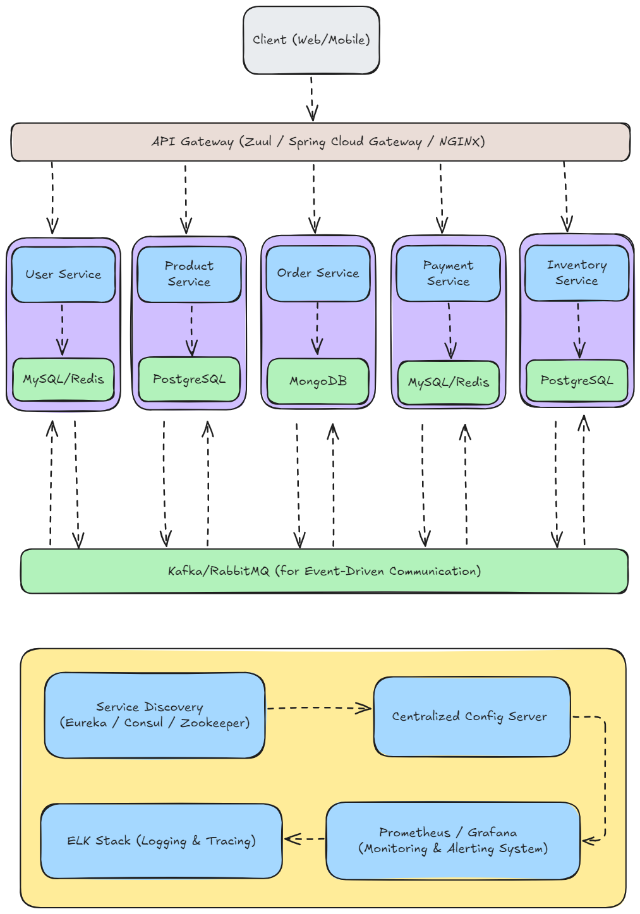

# 🛒 **Advanced E-commerce Microservices Application**

This project is a comprehensive **microservices-based e-commerce application**, built using **Spring Boot**, **Docker**, and deployed with **Kubernetes** on **Minikube**. The architecture is designed for scalability, performance, and flexibility. It features **API Gateway**, **Service Discovery**, **Centralized Configuration**, **Event-Driven Communication**, and **Distributed Logging and Tracing**.

---

## 📚 **Table of Contents**

1. [Microservices Overview](#microservices-overview)
2. [Advanced Project Architecture](#advanced-project-architecture)
3. [Technology Stack](#technology-stack)
4. [Microservices Repositories](#microservices-repositories)
5. [Setup Instructions](#setup-instructions)
6. [Scaling and Monitoring](#scaling-and-monitoring)
7. [Contributions](#contributions)
8. [License](#license)

---

## 🏗️ **Microservices Overview**

Each service in this application is responsible for a specific domain and runs independently, allowing for isolated development, deployment, and scaling.

1. **User Service**: Manages user registration, authentication, and profile management.
2. **Product Service**: Manages product catalogs, including product details, pricing, and stock management.
3. **Order Service**: Handles order creation, tracking, history and management.
4. **Payment Service**: Manages payment processing, transactions, and billing.
5. **Inventory Service**: Manages stock levels, inventory updates, and notifications.

Each service communicates with others via **REST APIs** or **event-driven messaging** using **Kafka** or **RabbitMQ**.

---

## 🛠️ **Project Architecture**

The application follows a **microservices architecture** with each service running in its own **Kubernetes pod**. The architecture includes the following key components:


- **Spring Boot Microservices**: Each service is built using Spring Boot.
- **API Gateway**: Manages routing, security, and load balancing.
- **Service Discovery**: Ensures dynamic service registration and discovery.
- **Centralized Configuration**: Manages configurations for all services.
- **Event-Driven Communication**: Uses Kafka or RabbitMQ for asynchronous communication.
- **Containerization**: All services are containerized using Docker.
- **Orchestration**: Kubernetes manages deployment, scaling, and monitoring.
- **Distributed Logging and Tracing**: ELK stack (Elasticsearch, Logstash, Kibana) and distributed tracing tools like Jaeger or Zipkin.




### 1. **Client (Web/Mobile)**
   - **Role**: The entry point for customers.
   - **How It Works**: Clients can be web or mobile applications that send requests (e.g., browsing products, placing orders) to the backend services via the **API Gateway**. The client does not interact with microservices directly but through the gateway to maintain loose coupling and abstraction.

---

### 2. **API Gateway (Zuul / Spring Cloud Gateway / NGINX)**
   - **Role**: Acts as the front door to all backend services.
   - **How It Works**: 
     - The **API Gateway** receives incoming HTTP requests from clients and routes them to the appropriate microservice based on predefined routing rules.
     - It handles **load balancing**, **authentication**, **rate limiting**, and **logging**.
     - For example, a request to `/users/login` would be routed to the **User Service**, and a request to `/products/list` would be routed to the **Product Service**.
     - The **API Gateway** also enforces security, using OAuth2 or JWT tokens to ensure only authorized users can access certain services.

---

### 3. **Microservices (User, Product, Order, Payment, Inventory)**
Each microservice is responsible for a specific domain, runs independently, and has its own database to ensure loose coupling. Here's how each service functions:

#### a. **User Service**
   - **Role**: Manages user accounts, authentication, and user profiles.
   - **How It Works**: 
     - Provides endpoints for **user registration**, **login**, and **profile management**.
     - When a user logs in, their credentials are verified, and a **JWT token** is issued.
     - **Database**: Stores user information (e.g., userID, email, password) in **MySQL** or **Redis** for fast session management.
     - **Data Cached**: User sessions, authentication tokens (e.g., JWT), user profiles. (By Caching, it reduces the load on the MySQL database and speeds up session management and user login/logout processes.)

#### b. **Product Service**
   - **Role**: Manages the product catalog, including details like price, description, and stock levels.
   - **How It Works**: 
     - Provides endpoints to **list products**, **add products**, and **update product details**.
     - For example, when an admin adds a new product, the **Product Service** stores product details in the database.
     - **Database**: Uses **PostgreSQL** to store product-related information like product ID, name, price, and stock.
     - **Data Cached**: Product catalog, product details (name, price, stock).(Product details are frequently accessed but infrequently modified. Caching product data in Redis improves the speed of product searches and catalog browsing.)


#### c. **Order Service**
   - **Role**: Handles the entire order lifecycle, from order creation to order tracking.
   - **How It Works**:
     - When a user places an order, the **Order Service** creates an order record, updates the inventory, and triggers the **Payment Service** for payment processing.
     - It also keeps track of the order status (e.g., pending, completed, canceled).
     - **Database**: Uses **MongoDB** for storing order details, as MongoDB’s schema flexibility is useful for managing complex order objects.
     - **Why No Cache?**: Order information is highly transactional and constantly changing (e.g., order statuses like pending, shipped, delivered). Caching is less useful here, as real-time data is critical for order management.

#### d. **Payment Service**
   - **Role**: Manages payment transactions, billing, and payment processing.
   - **How It Works**:
     - When the **Order Service** triggers a payment event, the **Payment Service** processes the payment using third-party payment gateways.
     - It confirms if the payment was successful or failed, then notifies the **Order Service** of the result.
     - **Database**: Uses **MySQL** or **Redis** for fast transaction and session management during payments.
     - **Data Cached**: Payment sessions, transaction results (temporary data).(By caching, it speeds up payment processes and reduces load on the database during transactions.)


#### e. **Inventory Service**
   - **Role**: Manages product stock and updates inventory based on orders.
   - **How It Works**:
     - When an order is placed, the **Inventory Service** is notified via **Kafka/RabbitMQ** to update the stock level of the product.
     - It tracks available stock, reserved stock, and out-of-stock items.
     - **Database**: Uses **PostgreSQL** for managing inventory levels and maintaining the history of stock changes.
     - **Data Cached**: Available stock, reserved stock. (Inventory is frequently checked and updated, so caching stock levels speeds up product availability checks while reducing the load on the PostgreSQL database.)


---

### 4. **Event-Driven Communication (Kafka / RabbitMQ)**
   - **Role**: Facilitates asynchronous communication between services using events.
   - **How It Works**:
     - Instead of services directly calling each other (synchronous communication), services communicate through **events** in an asynchronous manner.
     - For example, when an order is placed, the **Order Service** publishes an event (e.g., `OrderCreatedEvent`) to **Kafka**. Other services like **Inventory Service** and **Payment Service** subscribe to these events and take necessary actions (e.g., update stock, process payment).
     - This decouples the services, ensuring that each service can function independently.

---

### 5. **Service Discovery (Eureka / Consul / Zookeeper)**
   - **Role**: Enables dynamic service registration and discovery.
   - **How It Works**:
     - When a microservice (e.g., **User Service**) starts, it registers itself with the **Service Discovery** server.
     - This allows the **API Gateway** and other services to discover the location (IP address and port) of the running microservices dynamically.
     - **Eureka**, **Consul**, or **Zookeeper** are commonly used tools for **service discovery**. They provide high availability and ensure that services can be dynamically discovered, scaled, and replaced when needed.

---

### 6. **Centralized Config Server (Spring Cloud Config)**
   - **Role**: Manages configuration properties for all microservices from a central place.
   - **How It Works**:
     - Instead of each microservice having its own configuration file, all configuration is stored in a centralized repository (e.g., GitHub, SVN).
     - Each microservice fetches its configuration (e.g., database connection details, API keys) from the **Config Server** at startup.
     - This ensures that any change in configuration (e.g., database credentials, external API keys) can be made centrally without the need to update individual services.

---

### 7. **Databases (MySQL, PostgreSQL, MongoDB, Redis)**
   - **Role**: Each microservice has its own database for data storage, ensuring **data isolation**.
   - **How It Works**:
     - **User Service** and **Payment Service** use **MySQL** for transactional data, like user credentials and payment transactions.
     - **Product Service** and **Inventory Service** use **PostgreSQL** for product and stock-related data.
     - **Order Service** uses **MongoDB** for flexible document-based storage to handle complex order data structures.
     - **Redis** can be used as a caching layer for services like **User Service** to store session information for fast access.

---

### 8. **Monitoring & Alerting (Prometheus / Grafana)**
   - **Role**: Tracks and monitors the health, performance, and resource utilization of microservices.
   - **How It Works**:
     - **Prometheus** collects metrics (e.g., CPU usage, memory usage, request latency) from each microservice and stores them.
     - **Grafana** visualizes these metrics in a dashboard and sets up alerts when certain thresholds are crossed (e.g., high CPU usage).
     - Alerts can be sent via email or messaging platforms to notify admins of any potential issues.

---

### 9. **Logging & Tracing (ELK Stack: Elasticsearch, Logstash, Kibana)**
   - **Role**: Collects logs from all services and enables tracing of requests across microservices.
   - **How It Works**:
     - **Logstash** collects logs from microservices, processes them, and sends them to **Elasticsearch** for storage.
     - **Kibana** provides an interface to visualize logs and trace requests.
     - Distributed tracing tools like **Jaeger** or **Zipkin** help trace requests as they pass through multiple services (e.g., tracking an order from the **Order Service** to the **Payment Service** and **Inventory Service**).
     - This helps in debugging and optimizing the performance of microservices.


---

## 💻 **Technology Stack**

| **Component**              | **Technology**                                             |
|----------------------------|------------------------------------------------------------|
| **Backend**                 | Java 17, Spring Boot                                       |
| **API Gateway**             | Zuul, Spring Cloud Gateway, or NGINX                      |
| **Service Discovery**       | Eureka, Consul                                             |
| **Configuration**           | Spring Cloud Config                                        |
| **Event Streaming**         | Kafka or RabbitMQ                                          |
| **Databases**               | MySQL, PostgreSQL, MongoDB, Redis (for caching)            |
| **Containerization**        | Docker                                                     |
| **Orchestration**           | Kubernetes (Minikube for local development)                |
| **Security**                | OAuth2 / JWT for authentication & authorization            |
| **Logging & Tracing**       | ELK Stack (Elasticsearch, Logstash, Kibana), Jaeger/Zipkin |
| **Monitoring & Metrics**    | Prometheus, Grafana                                        |

---

## 📂 **Microservices Repositories**

Each microservice is independently developed and maintained in its own repository:

| **Microservice**          | **Repository URL**                                   | **Port**  |
|---------------------------|------------------------------------------------------|-----------|
| **User Service**           | [User Microservice Repo](https://github.com/mrajkishor/ecommerce-user-microservice) | `8081`    |
| **Product Service**        | [Product Microservice Repo](https://github.com/mrajkishor/ecommerce-product-microservice) | `8082`    |
| **Order Service**          | [Order Microservice Repo](https://github.com/mrajkishor/ecommerce-order-microservice) | `8083`    |
| **Payment Service**        | [Payment Microservice Repo](https://github.com/mrajkishor/ecommerce-payment-microservice) | `8084`    |
| **Inventory Service**      | [Inventory Microservice Repo](https://github.com/mrajkishor/ecommerce-inventory-microservice) | `8085`    |

Each repository contains:
- **Source code**
- **Dockerfile** for containerization
- **Kubernetes YAML manifests** for deployment
- **Test cases** (unit and integration)

---

## ⚙️ **Setup Instructions**

Follow these steps to set up the entire **e-commerce microservices application** on Kubernetes with Minikube.

### 1. **Start Minikube**

Start Minikube to run Kubernetes locally:

```bash
minikube start
```

### 2. **Build Docker Images**

For each microservice, navigate to its repository and build the Docker image. For example, for **User Service**:

```bash
cd ecommerce-user-microservice
docker build -t user-service:latest .
```

Repeat for other services (Product, Order, Payment, Inventory).

### 3. **Deploy Microservices on Kubernetes**

Each microservice has its own Kubernetes manifests for deployment. Here’s an example of the deployment for **User Service**:

```yaml
# user-service.yaml
apiVersion: apps/v1
kind: Deployment
metadata:
  name: user-service-deployment
spec:
  replicas: 2
  selector:
    matchLabels:
      app: user-service
  template:
    metadata:
      labels:
        app: user-service
    spec:
      containers:
      - name: user-service
        image: user-service:latest
        ports:
        - containerPort: 8081
---
apiVersion: v1
kind: Service
metadata:
  name: user-service
spec:
  selector:
    app: user-service
  ports:
  - protocol: TCP
    port: 8081
    targetPort: 8081
  type: ClusterIP
```

Apply the manifest:

```bash
kubectl apply -f user-service.yaml
```

Repeat for other services (Product, Order, Payment, Inventory).

**Verify Deployment**:
Check that all services are running successfully:

```bash
kubectl get pods
kubectl get services
```

### 4. **Configure API Gateway**

Set up an **API Gateway** for routing and security. Here's an example of the **Ingress** configuration for routing requests to the services:

```yaml
# ingress.yaml
apiVersion: networking.k8s.io/v1
kind: Ingress
metadata:
  name: ecommerce-ingress
spec:
  rules:
  - host: ecommerce.local
    http:
      paths:
      - path: /users
        pathType: Prefix
        backend:
          service:
            name: user-service
            port:
              number: 8081
```

Apply the **Ingress** manifest:

```bash
kubectl apply -f ingress.yaml
```

Update your `/etc/hosts` file to include the Minikube IP for `ecommerce.local`.

### 5. **Service Discovery and Centralized Configuration**

- Set up **Eureka** or **Consul** for service discovery.
- Set up **Spring Cloud Config** for centralized configuration of all microservices.

### 6. **Monitor Microservices with Prometheus and Grafana**

- Install **Prometheus** and **Grafana** to monitor the system's health and performance.
  
```bash
minikube addons enable metrics-server
minikube dashboard
```

### 7. **Log and Trace Requests**

Use the **ELK Stack** (Elasticsearch, Logstash, Kibana) and distributed tracing tools like **Jaeger** or **Zipkin** to log and trace requests across services for debugging and performance analysis.
- Use `kubectl logs` to inspect logs and troubleshoot issues:
```bash
kubectl logs <pod-name>
```

---

## 📈 **Scaling and Monitoring**

### **Scaling**

You can scale services dynamically with Kubernetes by adjusting the number of replicas:

```bash
kubectl scale deployment user-service-deployment --replicas=3
```

### **Monitoring**

Use **Prometheus** and **Grafana** to monitor key metrics like CPU, memory, and request latency.

- **Prometheus** collects metrics from services.
- **Grafana** visualizes these metrics with customizable dashboards.
  
To view real-time logs and monitor distributed tracing, use **ELK Stack** and **Jaeger**.

---

## 🤝 **Contributions**

Contributions are welcome! If you'd like to contribute:

1. Fork the repository for the microservice you want to work on.
2. Create a new branch: `git checkout -b my-new-feature`.
3. Make your changes and commit: `git commit -m 'Add new feature'`.
4. Push to the branch: `git push origin my-new-feature`.
5. Open a pull request for review.

---

## 📄 **License**

This project is licensed under the **Apache License 2.0**. See the [LICENSE](LICENSE) file for details.

---

### 📧 **Contact**

For any questions or feedback, feel free to reach out to **mrajkishor331@gmail.com**.
